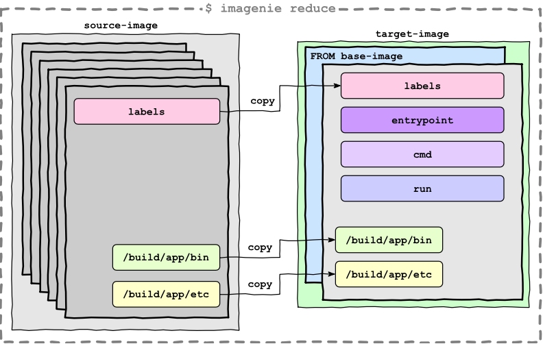

<p align="center">
    <a alt="GoReport" href="https://goreportcard.com/report/github.com/otaviof/imagenie">
        
    </a>
    <a alt="CI Status" href="https://travis-ci.com/otaviof/imagenie">
        
    </a>
    <a alt="Quay.io Container Image" href="https://quay.io/repository/otaviof/imagenie">
        
    </a>
</p>

# `imagenie`

Is a general purpose container image tool, allowing arbitrary actions and composition of new images.
It's meant to take place in a container image build workflow.

This application [embeds `buildah`][buildahembed] to act as a container-manager, and allow the
manipulation of container images.

## Sub-Commands

### `pull`

Pull upstream container image into local storage. Example:

```sh
imagenie pull alpine:latest
```

### `reduce`

Compose a new container image (`target-image`), based on `base-image` and `source-image`. Represented
in the following image:

<p align="center">
    
</p>

The following parameters are present on `reduce` sub-command.

| Parameter    | Type    | Description |
|--------------|---------|-------------------------------------------------------------|
| `copy`       | slice   | path to copy from source to target image, as `<src>:<dest>` |
| `entrypoint` | slice   | entrypoint directive for target-image                       |
| `cmd`        | slice   | command (cmd) directive for target-image                    |
| `run`        | slice   | command to run in target-image                              |

All `slice` typed parameters can be specified several times, and will be accumulated.

Example:

```sh
imagenie reduce \
    alpine:latest \
    alpine:latest \
    runtime:latest \
        --copy=/etc/os-release:/tmp \
        --copy=/etc/alpine-release:/tmp
```

## Usage

Since `imagenie` is a Linux only tool, you most probably should rely in the [container-image][quayio]
directly. Like for instance:

```sh
docker run --privileged quay.io/otaviof/imagenie:latest --help
```

## Contributing

All development dependencies and tooling is located at [`Dockerfile.dev`](./Dockerfile.dev), and
based on this image you have a complete development environment for the project. To start it up, run:

```sh
make devcontainer-run DEVCONTAINER_ARGS='bash -l'
```

For [Visual Studio Code][vscode] users, install [Remote Containers extension][vscodecontainers],
and re-open the project in the container, which will be using the same `Dockerfile.dev`.

During development, use `make run` to execute the command-line application with `go run`, like for
instance `make run RUN_ARGS='--help'`.

### Building

To build the application binary, execute:

```sh
make
```

In order to build the application conatiner image, run:

```sh
make image
```

### Testing

The primary command to execute the tests is:

```sh
make test
```

And in case of running in other platforms than Linux, you can execute the targets directly in the
development container, via:

```sh
make devcontainer-image
make devcontainer-run DEVCONTAINER_ARGS='make test'
```

Continuous integration steps can be found at [`.travis.yml`](./.travis.yml) file.


[buildahembed]: https://github.com/containers/buildah/blob/master/docs/tutorials/04-include-in-your-build-tool.md
[quayio]: https://quay.io/repository/otaviof/imagenie
[vscode]: https://code.visualstudio.com/
[vscodecontainers]: https://marketplace.visualstudio.com/items?itemName=ms-vscode-remote.remote-containers